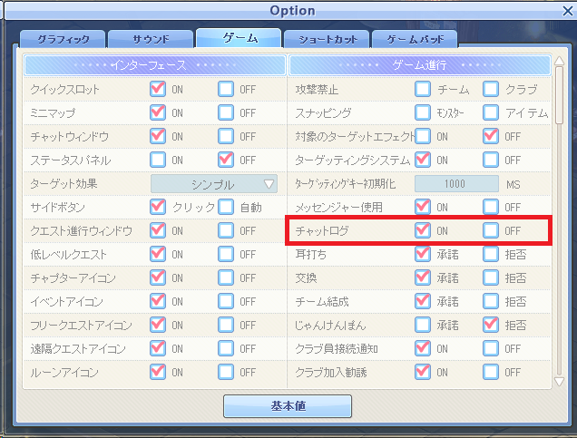
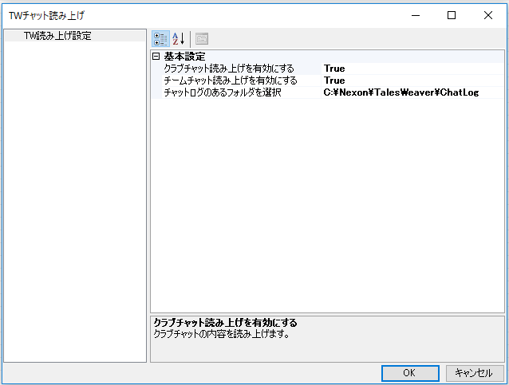
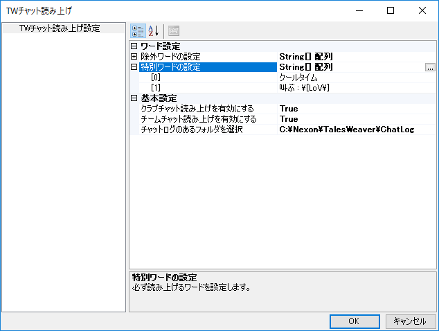

# 棒読みちゃん TWプラグイン

Tales Weaverのチャットログを棒読みちゃんに読ませるプラグインです。

## 使い方

### 事前準備  

以下の準備をあらかじめ実施しておきます。

* [棒読みちゃんのダウンロード](http://chi.usamimi.info/Program/Application/BouyomiChan/)
* TWチャットログ機能の有効化

### プラグインの登録

[Releaseページ](https://github.com/omatztw/BouyomiChan_TW_Plugin/releases)より、Plugin_TW.dllをダウンロードし、棒読みちゃんのフォルダ（BouyomiChan.exe があるところ）に置くだけ

### 設定

以下の設定画面から設定変更可能です。

#### ワード設定

* 除外ワードの設定  
除外するワードを複数登録可能です。条件に合致するログは読み上げません。正規表現での指定が可能です。
* 特別ワードの設定  
特別ワードを複数登録可能です。条件に合致するログはチャットの種類を問わず読み上げます。正規表現での指定が可能です。

#### 基本設定

* 有効化/無効化  
各種チャットの読み上げの有効/無効を選択できます。初期設定は以下の表を確認ください。
* TWフォルダフォルダの場所  
初期設定では、TWのデフォルトインストール場所が設定されていますが、TWのインストール先が異なる場合に設定変更可能です。
* 自分の発言の読み上げ有効化/無効化
自分の発言を読み上げ対象から除外することができます。(False設定で除外)
* 発言者の名前の読み上げ有効化/無効化
発言者の名前を読み上げないようにすることができます。(False設定で読み上げない)

|チャット種別|デフォルト設定|
|:--:|:--:|
|クラブチャット|True|
|チームチャット|True|
|一般チャット|False|
|耳打ち|True|
|システムメッセージ|False|
|管理用メッセージ|False|

### 設定例

特別ワードの設定例として、開発時点で実施していた「ロード オブ ヴァーミリオン」タイアップイベントで以下のメッセージを読み上げるものを追加してみた。

* 「叫ぶ : [LoV] 優羽莉のベルの音でゲートが【x0%】開かれました。」
* 「叫ぶ : [LoV]ゲート化が完了して強力なモンスターがプラバ前哨基地に召喚されます。」

共通の文字として最初の「叫ぶ : [LoV]」までマッチすれば良さそうなので以下のように設定した。

`\[`のように、`\`(画像では￥)を入れているのは、正規表現における特殊文字をエスケープするため。  
正規表現を詳しく知りたい人は「正規表現　入門」などでググってみると幸せになれるかも！  
注：「クールタイム」は別の用途です。

## Developer

* テイルズウィーバー エルフィンタ鯖 「おまつ先生」
    * 開発者へのお問い合わせは、[Discord](https://discord.gg/ksFC4rP)までどうぞ(=ﾟωﾟ)
    * またはゲーム内のチャットでも
    * Twitterも始めました [@omatztw](https://twitter.com/omatztw)

