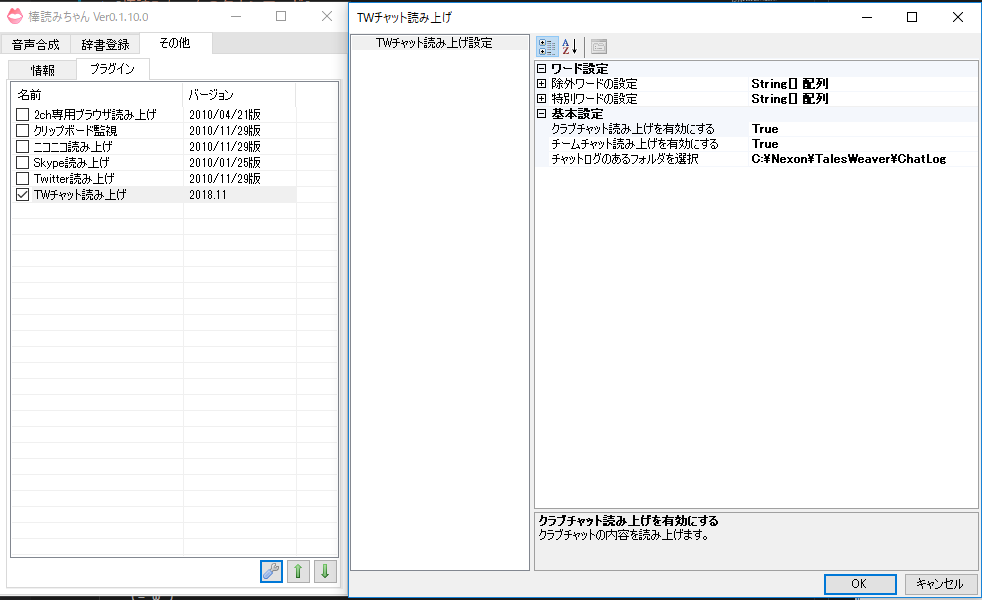

# 棒読みちゃん TWプラグイン

Tales Weaverのチャットログを棒読みちゃんに読ませるプラグインです。

## 使い方

### 事前準備  

以下の準備をあらかじめ実施しておきます。

* 棒読みちゃんのダウンロード
* TWチャットログ機能の有効化

### プラグインの登録

[Plugin_TW.dll](dist/Plugin_TW.dll)を棒読みちゃんのフォルダに置くだけ

### 設定

初期設定は、チームチャット、クラブチャットを読み上げる設定になっています。以下の設定画面から適宜変更可能です。

## Developer

* テイルズウィーバー エルフィンタ鯖 「おまつ先生」
    * 開発者へのお問い合わせは、[Discord](https://discord.gg/ksFC4rP)のまでどうぞ(=ﾟωﾟ)
    * またはゲーム内のチャットでも

