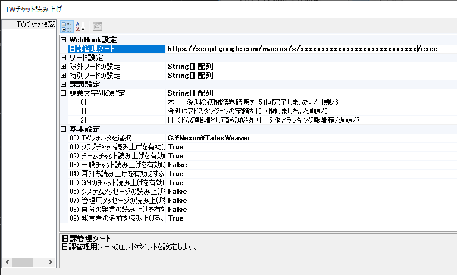

# 棒読みちゃん TWプラグイン

Tales Weaverのチャットログを棒読みちゃんに読ませるプラグインです。

## 使い方

### 事前準備  

以下の準備をあらかじめ実施しておきます。

* [棒読みちゃんのダウンロード](http://chi.usamimi.info/Program/Application/BouyomiChan/)
* TWチャットログ機能の有効化


### プラグインの登録

[Releaseページ](https://github.com/omatztw/BouyomiChan_TW_Plugin/releases)より、Plugin_TW.dllをダウンロードし、棒読みちゃんのフォルダ（BouyomiChan.exe があるところ）に置くだけ

### 設定

以下の設定画面から設定変更可能です。


#### ワード設定

* 除外ワードの設定  
除外するワードを複数登録可能です。条件に合致するログは読み上げません。正規表現での指定が可能です。
* 特別ワードの設定  
特別ワードを複数登録可能です。条件に合致するログはチャットの種類を問わず読み上げます。正規表現での指定が可能です。

#### 基本設定

* 有効化/無効化  
各種チャットの読み上げの有効/無効を選択できます。初期設定は以下の表を確認ください。
* TWフォルダフォルダの場所  
初期設定では、TWのデフォルトインストール場所が設定されていますが、TWのインストール先が異なる場合に設定変更可能です。
* 自分の発言の読み上げ有効化/無効化
自分の発言を読み上げ対象から除外することができます。(False設定で除外)
* 発言者の名前の読み上げ有効化/無効化
発言者の名前を読み上げないようにすることができます。(False設定で読み上げない)

|チャット種別|デフォルト設定|
|:--:|:--:|
|クラブチャット|True|
|チームチャット|True|
|一般チャット|False|
|耳打ち|True|
|GMの発言|True|
|システムメッセージ|False|
|管理用メッセージ|False|


### 設定例

特別ワードの設定例として、開発時点で実施していた「ロード オブ ヴァーミリオン」タイアップイベントで以下のメッセージを読み上げるものを追加してみた。

* 「叫ぶ : [LoV] 優羽莉のベルの音でゲートが【x0%】開かれました。」
* 「叫ぶ : [LoV]ゲート化が完了して強力なモンスターがプラバ前哨基地に召喚されます。」

共通の文字として最初の「叫ぶ : [LoV]」までマッチすれば良さそうなので以下のように設定した。


`\[`のように、`\`(画像では￥)を入れているのは、正規表現における特殊文字をエスケープするため。  
正規表現を詳しく知りたい人は「正規表現　入門」などでググってみると幸せになれるかも！  
注：「クールタイム」は別の用途です。

### 課題管理機能

課題管理用として、特定の文字列を見つけた場合、指定のエンドポイントへHTTP POSTする機能です。

例えば、以下のように設定した場合を考えます。



この時、キャラAでログイン状態で、「本日、深淵の狭間結界破壊を「5」回完了しました。」というメッセージがゲーム内で発生した場合、日課管理シートに設定してある以下のURLに対して

`https://script.google.com/macros/s/xxxxxxxxxxxxxxxxxxxxxxxxxx/exec`

以下の情報をPOSTします。

```json
{
    "name": "キャラA",
    "col": 6,
    "sheet": "日課",
    "time": "2021/03/21 21:05:22",
    "matchStr": "本日、深淵の狭間結界破壊を「5」回完了しました。"
}
```

あとはエンドポイント側でこの情報を用いて処理を実装するだけです。エンドポイントに関しては各自準備する必要があります。Google SpreadSheetを使ったエンドポイントの作成方法は後日公開予定です。  
すぐに知りたい場合は直接連絡してください。

## Developer

* テイルズウィーバー エルフィンタ鯖 「おまつ先生」
    * またはゲーム内のチャットでも
    * Twitterも始めました [@omatztw](https://twitter.com/omatztw)

